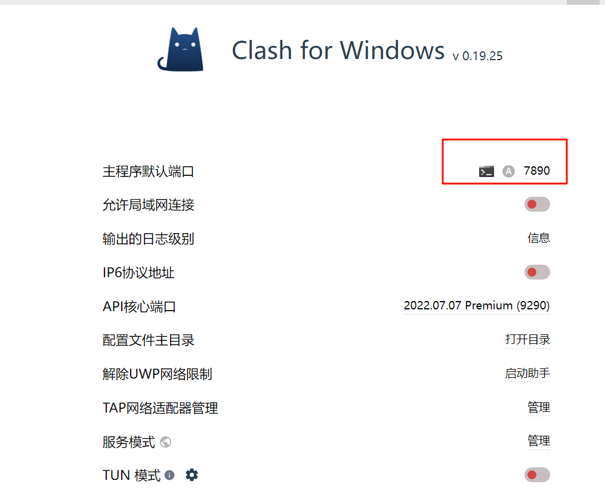
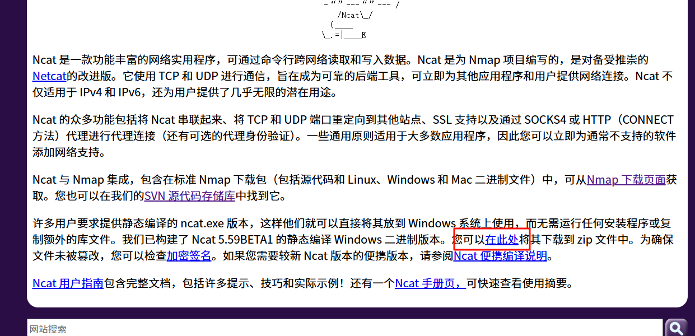

由于防火墙原因导致速度过慢  
我们可以使用工具利用Clash来配置代理使速度提高


由于这里使用的是SSH连接 所以我们需要在git中对其SSH的config文件进行配置  
config文件默认路径为C:\Users\Dandelin\.ssh（gitbash中：～/.ssh)  
config文件默认不存在 我们需要在默认路径下创建 并且将代理地址设置为**127.0.0.1:7890**(7890为主机中监听clash的端口,如上图)  
```
$touch config  #创建config文件
$vim config    #编辑config文件
#添加以下内容:
Host github.com
    HostName github.com
    User git
    IdentityFile ~/.ssh/id_ed25519
    ProxyCommand ncat -x 127.0.0.1:7890 %h %p
```

由于SSH代理需要使用 ncat 所以需要在git 中安装ncat，在以下连接下载ncat的静态编译版本
https://nmap.org/ncat/


下载完成后需要ncat.exe的安装路径/E/netcat添加至gitbash中  
`export PATH=$PATH:/E/netcat`

查看是否成功添加路径  
```
$ which nc
/E/netcat/nc

```
成功配置.