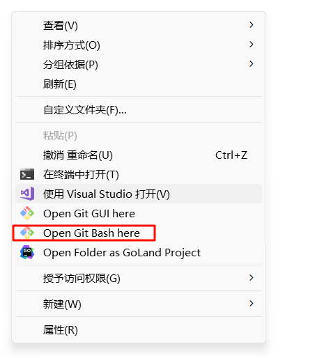
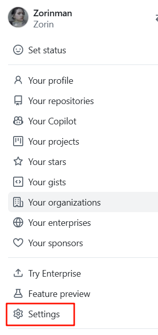
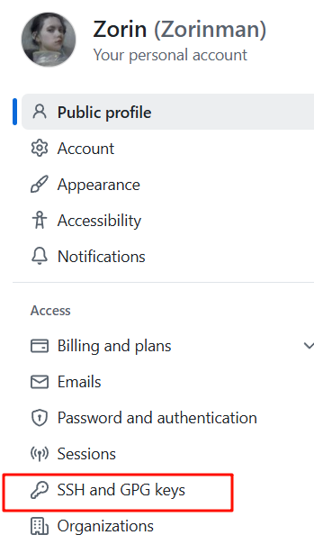
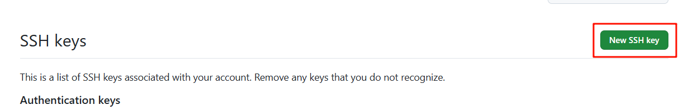
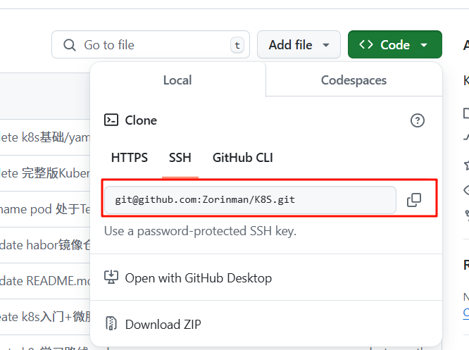
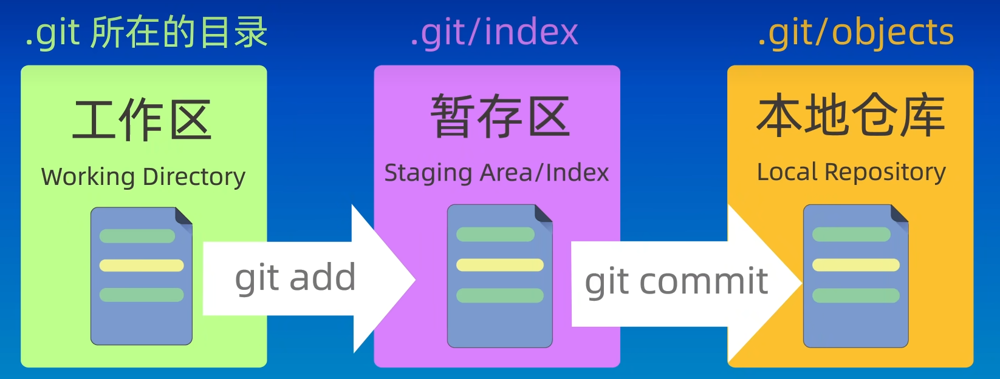

参考视频  
https://www.bilibili.com/video/BV1s3411g7PS/?spm_id_from=333.788.top_right_bar_window_history.content.click&vd_source=b9c639db66d1d92699bdd73eff797082  
https://www.bilibili.com/video/BV1HM411377j?spm_id_from=333.788.videopod.sections&vd_source=b9c639db66d1d92699bdd73eff797082  


### 1.首先下载git (for windows)

https://git-scm.com/downloads/win  
这里会自动安装其命令行工具git bash, 接下来的命令操作均在**git bash**进行
### 2.创建本地仓库  
在本地创建一个文件夹用于本地仓库  
这里我创建的仓库目录为 /E/gitrepo  
在该文件夹下右键选择用git bash打开可以直接操作当前目录


为当前git本地仓库配置 name 和email（随意即可）
`git config --global user.name"Zorin"`  
`git config --global user.email "XXXXXXX@qq.com"`  
在当前仓库下初始化  
`git init`

如果只要在本地仓库做版本关联那么这里就完成了全部配置，之后只需根据[git常见命令](https://github.com/Zorinman/git-github/blob/main/git%E4%B8%8Egithub/git%E7%9A%84%E5%9F%BA%E6%9C%AC%E5%91%BD%E4%BB%A4.md)
进行操作即可进行版本控制
------

### 3.将git和github进行连接(通过SSH)
为git生成一对密钥用于SSH连接认证
将密钥文件生成于默认路径C:\Users\Dandelin\.ssh(gitbash中：~/.ssh)
```
$ssh-keygen 
# 提示输入保存路径时直接回车保存在默认路径（不保存在默认路径会导致git不能识别）
#Enter file in which to save the key (/c/Users/YourUsername/.ssh/id_ed25519): 
# 提示输入密码时回车表示无密码（可选）
#Enter passphrase (empty for no passphrase): 
#Enter same passphrase again:
# 生成完成
```
最终会生成两个文件.pub后缀的为公钥，打开复制里面的公钥内容  
  

打开github 点击右上角头像处 选择Setting  
  
打开SSH and GPG keys  
  
创建SSH key ，并将git生成的公钥内容粘贴即可  
  

### 4.关联远程仓库
选择github上需要关联的仓库，查看并复制github的SSH连接  
  
在git bash 中将git于github上的仓库关联  
`git remote add origin git@github.com:Zorinman/K8S.git  ` origin为github上需要关联仓库的名字 可自行修改（如我的为K8S）  

**建议一个本地仓库对应一个远程仓库**（也可以在一个本地仓库路径下使用git remote add 添加多个远程仓库 ）
### 5.推送，拉取仓库内容

git有三个分区 分别成为工作区 暂缓区 本地仓库
首先将工作区的内容add添加至暂缓区，完成修改后最后commit提交至本地仓库
当在本地commit之后才可以将内容推送至远程仓库


如果本地仓库分支名称为master则需要修改为main，因为github为main需要一致（上产至github的main分支中）  
`git branch -m master main`

 第一次将本地仓库内容推送至github的某个仓库 `git push -u 远程仓库名称 远程分支名`     
 第一次将github某个仓库拉取至本地 `git pull -u 远程仓库名称 远程分支名`  
之后可直接`git push` 和 `git pull`， 默认为第一次的远程仓库名称和远程分支名  

**推送出现冲突则可能是本地仓库和远程仓库的内容不一致 需要先将远程仓库的拉取下来**  
使用 --allow-unrelated-histories 选项进行拉取：
在执行拉取操作时，添加 --allow-unrelated-histories 选项，以允许合并不相关的历史：  
`git pull git-github main --allow-unrelated-histories ` 
这将允许 Git 合并本地和远程仓库的历史，即使它们没有共同的祖先。

**拉取推送速度慢速度慢解决方案参考 [git clone pull push速度慢解决](git clone pull push速度慢解决.md)**  
