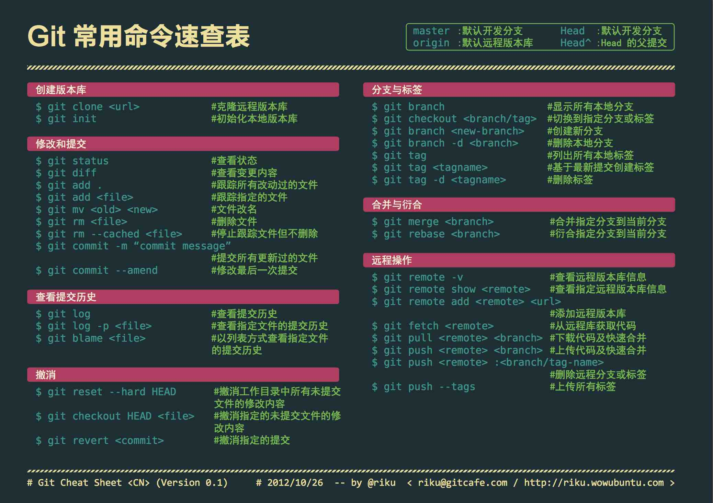

 
```
git add *png                将后缀命为png的文件添加至暂缓区(png可修改为任意后缀）
git branch -m master main   重命名本地仓库master分支为main
git push -u git-github main  第一次推送-将名为git-github的远程仓库的main分支设置为默认分支
git pull -u git-github main  第一次拉取-将名为git-github的远程仓库的main分支设置为默认分支

直接用 git push <远程仓库名> <远程分支名> 需要本地由同名分支
git push <远程仓库名> HEAD:<远程分支名> 把当前所在本地分支推送到远程dev分支（不要求同名)
git push <远程仓库名> <本地分支名>:<远程分支名>  把某本地分支推送到远程分支（不要求同名）

git checkout -b <本地xx分支> <远程仓库xxx>/<远程仓库分支xxx> 将远程仓库xxx的xxx分支拉取到本地xxx分支（自动创建本地xxx分支跟踪）
```
