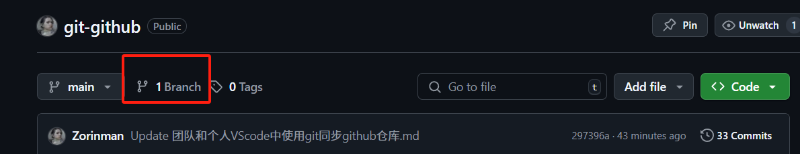
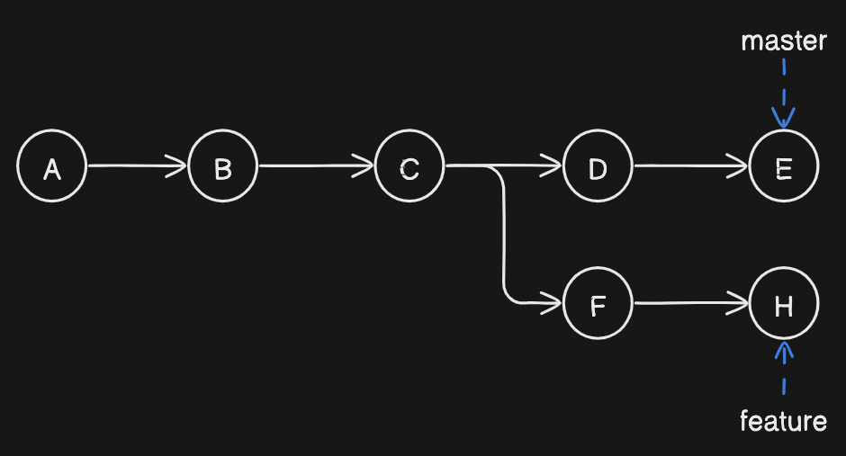
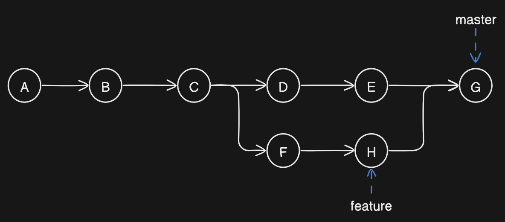
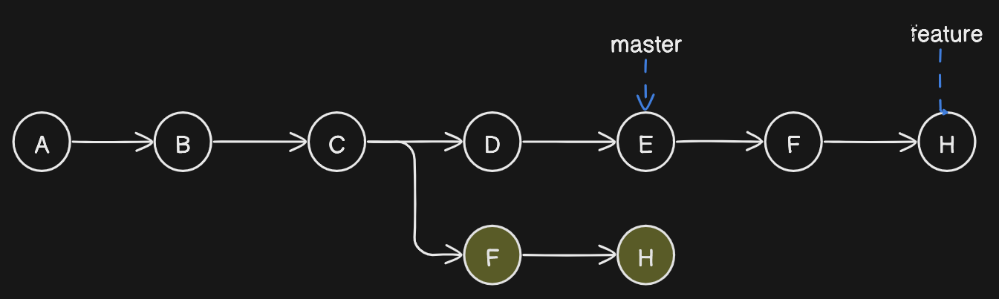
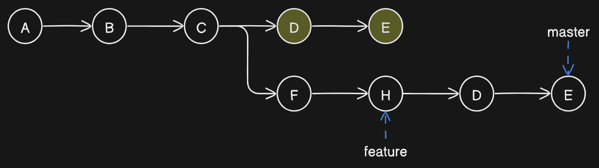
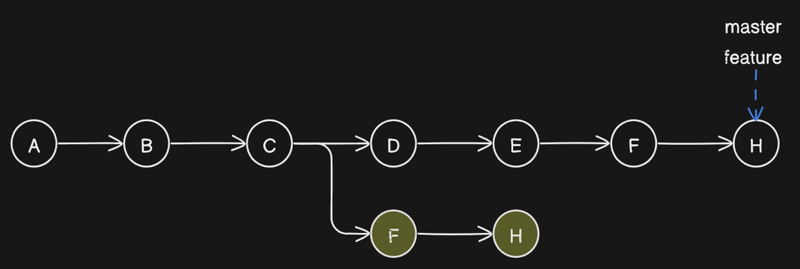
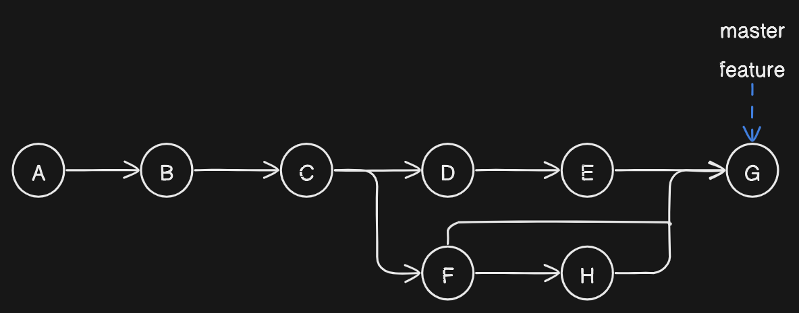

# 项目开发分支管理
## 方式1（公司项目）：
- `git clone` 远程仓库

- 本地修改分支为新名称A 用于保存将要推送到远程仓库的最终修改

- 再在本地创建一个新分支B，用于日常的提交

- 日常开发保存提交到B，最终将要提交的有效代码从B合并到A，最终将A分支提交到远程仓库，远程仓库若没有分支A则会自动在远程仓库创建分支A

- 最终在页面上对操作远程仓库，在分支A中发起`pull request`，请求将`分支A`合并到`受保护主分支main`,最终等待管理员审查合并即可。
- 
## 方式2（对它人仓库贡献）
- `fork`源仓库到自己的远程仓库
- `git clone` 自己的远程仓库

- 再在本地创建一个新分支B，用于日常的提交

- 日常开发保存提交到B并推送到`自己远程仓库分支B`，在页面上对操作远程仓库，将要提交的有效代码从B合并到`自己的仓库main分支`，最终将自己仓库的main分支发起`pull request`，请求将`自己仓库的分支main`合并到`受保护源仓库主分支main`,最终等待管理员审查合并即可。


# [版本回退](/git在本地仓库的操作（含版本回退.md)

# 删除本地分支/github分支
## 删除本地分支
**场景**：删除test分支
切换到其它不需要删除的其它分支（比如main）
`git checkout main`
**删除 test**
`git branch -d  test`

**强制删除**
`git branch -D  test`

## 删除github分支
在github上点击branch 选中特定分支删除
`注意不能删除default分支`

# GitHub 项目回退到之前的某个版本

在GitHub上回退到之前的某个版本，可以通过以下步骤来实现：

## 操作步骤

1. **找到 commit ID**：打开项目仓库页面，点击 "Commits"，找到要回退的版本并复制其 commit ID

2. **本地回退**：在本地项目目录执行
   ```bash
   git reset --hard <commit_ID>
   ```

3. **强制推送**：将更改同步到远程仓库
   ```bash
   git push origin master --force
   #如果以及关联远程仓库可以直接
   git push
   ```
   *注意：如果在其他分支，将 `master` 替换为当前分支名*

## 注意事项

- **谨慎使用强制推送**：会覆盖远程仓库历史记录，可能影响其他协作者
- **备份重要更改**：建议先创建新分支或备份当前分支
- **团队协调**：确保团队了解你要执行的操作

# 挑拣（cherry-pick）

**用于将A分支的某个提交应用到B分支中而不是应用整个A分支**

这时分两种情况：
- 一种情况是，你需要另一个分支的所有代码变动，那么就采用合并（`git merge`）；
- 另一种情况是，你只需要部分代码变动（某几个提交），这时可以采用 `Cherry pick`。

## 基本用法

从test分支挑出某个提交F应用到main分支中：

1. 获取test分支提交F的哈希值
2. 切换到 master 分支：`git checkout main`
3. 执行挑拣操作：`git cherry-pick <commitHash>`

上面的操作完成以后，可以看到，main分支的末尾增加了一个提交F：

```
main    A - B - C - D - F   
        \
test      E - F - G 
```

# Git 三种合并方式（rebase / merge / squash）

## 问题背景

在使用 Git（分布式版本控制系统）时，往往不会直接在主分支上面直接开发，而是新建一个分支进行开发。

那么当我们在新分支上面完成一个功能时，便需要合并到主分支。

## 三种合并方式

- **merge** - 普通合并
- **rebase and merge** - 变基合并  
- **squash and merge** - 压缩合并

## 初始化



*图1：初始两个分支的状态，现基于此对合并（merge）和变基（rebase）操作讲解。*

存在两个分支，当前状态为：

```
master : A -> B -> C -> D -> E
feature : A -> B -> C -> F -> H
```

## Merge



*图2：当 master 分支与 feature 分支都存在新的 commit 时，那么在 master 分支使用 `git merge feature` 会将 master 与 Feature 的最新 commit (E / H) 打包，在 master 分支提交为一个新的 commit (G)。*

## Rebase



*图3：当在 feature 分支使用 `git rebase master`，会将 feature 分支的基变到 master 分支上。*

**注意：** 新 commit (F / H) 对比与旧提交，如图3 黄色的部分，其 sha 值不一致，说明 git rebase 是创建了新的提交。



*图4：当在 master 分支使用 `git rebase feature`，会将 master 分支的基变到 feature 分支上。*

## Rebase and Merge



*图5：是由图3进行 merge 操作实现的，这是 merge 操作的另一种情况：当 master 相对于 feature 没有新的提交时，在 master 分支上使用 `git merge feature` 会直接将 master 分支指向 feature 分支。*

## Squash and Merge



*图6：squash 顾名思义是压缩，将新分支的 commit (F / H) 进行打包压缩在与 master 分支进行 merge 操作。*

## 优缺点对比

| 操作       | 优点                                 | 缺点                                 |
| ---------- | ------------------------------------ | ------------------------------------ |
| **merge**  | • 简单直观<br>• 保留完整历史         | • 合并提交冗余<br>• 分支历史不够整洁 |
| **rebase** | • 整洁的分支历史<br>• 清晰的提交历史 | • 改变提交历史<br>• 容易产生合并冲突 |
| **squash** | • 清晰的提交历史                     | • 丢失提交信息<br>• 破坏历史信息     |

## 使用建议

### 何时使用 Merge
- 合并公共分支时
- 需要保留完整历史记录时
- 团队协作中需要明确显示合并点

### 何时使用 Rebase
- 个人功能分支合并到主分支前
- 需要保持线性历史时
- 本地开发分支需要同步主分支最新代码

### 何时使用 Squash
- 功能分支包含多个小提交时
- 需要将多个提交合并为一个有意义的提交时
- 清理提交历史时

## 常用命令

```bash
# Merge 操作
git merge feature-branch

# Rebase 操作
git rebase master

# Squash 操作（在合并时使用）
git merge --squash feature-branch
git commit -m "feat: 完成功能开发"
```

## 注意事项

1. **不要在公共分支上使用 rebase**：这会改变提交历史，影响其他协作者
2. **合并前先同步主分支**：避免产生不必要的合并冲突
3. **选择合适的合并策略**：根据项目需求和团队规范选择
4. **保持提交信息清晰**：特别是使用 squash 时，要写清楚合并的功能描述
