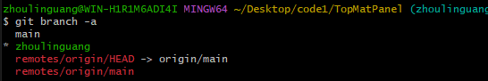
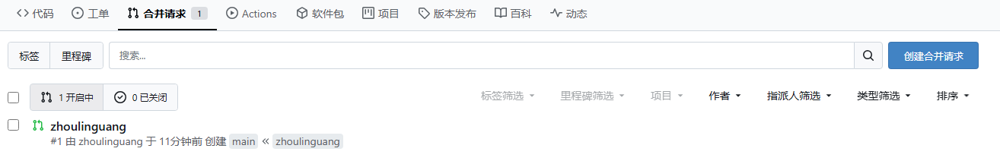

**与`git的使用.md`中的流程类似**
⭐第一次拉取和推送使用-u如`git push -u origin main`和`git pull -u origin main`这表示设置默认上游分支，后续就可以直接`git pull` 和`git push `不用加远程仓库名和分支名
⭐注意 使用SSH连接如果你为了解决拉取速度慢在 `~/.ssh`的config文件中配置了代理加速， 那么你需要 `ncat`走代理带能拉取推送远程仓库，我们还需要下载`ncat`并且编辑环境变量中添加`ncat.exe`的所在路径（下载请看git clone pull push速度慢解决.md)
⭐使用HttpS时如何连接的是私人仓库必须要带token，此时更推荐ssh

## 1.安装git

## 2.**初始化本地仓库**:可以直接在VScode的源代码管理中点击`初始化仓库` 或使用命令行命令`git init`

## 3.**创建分支**: 如果没有本地主分支则需要创建并切换到那个分支 `git checkout -b <branch-name>`

-------
# 个人测试：

 ## 4.**将git于github上的仓库关联（这里使用ssh,你也可以用HttpS）**
 `git remote add origin git@github.com:Zorinman/K8S.git`   origin为自己定义的远程仓库的备注名  可自行修改（如我的远程仓库为K8S我可以直接使用默认的origin或者修改为K8S或者）

## 5.**本地分支与远程分支名字保持一致（个人）**
如需要：`git branch -m master main` 重命名本地主分支master为main

## 6.**同步本地仓库和远程仓库开始推送**
### 某一方仓库为空
**情况1.本地仓库完全为空**：
- 先把远程仓库的内容拉去下来:` git pull  origin main ` 
- 后续直接`git push -u origin main` 和`git pull  origin main`  

**情况2 远程仓库完全为空**  
直接 `git push -u origin main`

-------------------

### 一方强制覆盖另一方(舍弃内容)
**本地仓库完全覆盖远程仓库（丢弃远程所有内容，强制同步本地内容）**

`git push -u origin main --force` (origin是远程仓库名，main是远程分支名)

**远程仓库完全覆盖本地仓库（丢弃本地所有内容，强制同步远程内容）**
本地仓库已经初始化并有提交删除等信息：`git pull origin main --force` 强制拉取远程 main 分支，覆盖本地冲突文件


---------------

# 团队开发一般流程：

4.**关联远程仓库** `git remote add origin 仓库Https\SSH`(可以是项目仓库，也可以是你fork的仓库，origin为自己定义的远程仓库的备注名)

5 拉取团队项目到本地仓库 ` git pull  origin main ` 

6.**在本地创建并切换到新分支A（避免直接修改 main分支）**
`git checkout -b <新分支A>`

7.**git commit -m 提交本地修改到远程分支A**

8.**推送到远程仓库**
推送前再进行一次同步 防止远程 main 分支在这期间可能有新更新
``` shell 
git checkout main                  # 切换到主分支
git pull origin main               # 拉取远程最新代码
git merge feature/your-feature-name  # 合并功能分支（有冲突则需要手动解决）

```


`git push -u origin <新分支名>`
这时候远程仓库会自动创建这个新分支并且将内容推送到该分支(项目仓库或者你fork的仓库)

8.**发送合并请求**
在github远程仓库(项目仓库或者你fork的仓库)页面选择你的新分支，点击进行合并请求， 团队成员审核后，代码会合并到主分支（如 main）


# 在团队TopMat的提交流程
⭐本地分支`test`用于日常提交，最终将本地分支`test`有效的代码合并到本地分支`zhoulinguang`保证最终本地提交并推送到远程仓库的 `zhoulinguang`分支，然后在网页端请求合并到远程仓库保护分支`main`
- 1.拉取项目到本地`git clone https地址`

- 2.拉取后项目中自带.git文件，这时候已经自动关联了远程仓库

- 3.为了推送时不影响远程仓库主要的main分支，创建一个叫`zhoulinguang`新的分支（跳转到该分支： `git checkout -b zhoulinguang`）

- 4.此时通过`git branch -a` 可以查看所有分支， 可以看见绿色的是本地分支，*表示我当前在的本地分支
红色表示远程仓库的所有分支和目前只想的分支




- 5 在本地仓库再创建一个分支`test`用于日常提交

- 6.提交本地日常修改到分支`test`

- 7 将本地分支`test`的最终正确代码合并到本地分支`zhoulinguang`

- 8.直接推送本地分支`zhoulinguang`到远程，如果远程没有该分支则会自动创建：`git push -u origin zhoulinguang`，**或者直接在vscode上点击发布新分支**

- 9.之后在git网站上可以看到新的推送信息，我们这时候点击创建合并请求，然后之后等管理员来合并就可以了
 
